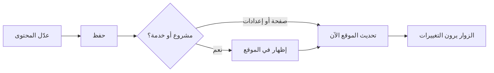

# غولدن كواليتي — إدارة محتوى الموقع

Arabic-first CMS dashboard for editing Golden Quality website content (pages, projects, services, media, settings).

## Stack

- Next.js (App Router) + TypeScript + Tailwind CSS
- Cairo font, RTL (`dir="rtl"`, `lang="ar"`)
- Talks to the CMS API over REST + JWT

## Requirements

- Node.js 20+
- Running CMS API (default `http://localhost:4000`) with dashboard CORS origin allowed (`http://localhost:3001`)

## Setup

```bash
npm install
cp .env.example .env.local
```

Edit `.env.local`:

| Variable | Purpose |
|----------|---------|
| `NEXT_PUBLIC_API_URL` | API base including `/api/v1` (e.g. `http://localhost:4000/api/v1`) |
| `NEXT_PUBLIC_WEBSITE_URL` | Public site URL for «عرض في الموقع» links |
| `NEXT_PUBLIC_USE_AUTH_MOCK` | Optional `true` — any email/password logs in (no API) |

## Login credentials

Use the **admin user seeded by the API** (not committed passwords):

1. In the API repo `.env`, set `ADMIN_EMAIL` and `ADMIN_PASSWORD` (min 8 characters).
2. Run `npm run seed` in the API.
3. Sign in on the dashboard with that email/password.

API `.env.example` defaults for local seed are typically:

- Email: `admin@example.com`
- Password: whatever you set in `ADMIN_PASSWORD` (example placeholder: `change-me` — must be ≥ 8 chars)

For UI-only work without the API: set `NEXT_PUBLIC_USE_AUTH_MOCK=true` and use any email/password.

## Develop

```bash
npm run dev
```

Opens at [http://localhost:3001](http://localhost:3001) (port **3001** so it matches API CORS defaults).

Unauthenticated visits redirect to `/login`.

## Editor workflow



1. **حفظ** — يخزّن التعديلات في النظام فقط.
2. **إظهار في الموقع** — يجعل المشروع/الخدمة ظاهرة للزوار (يتطلب صورة رئيسية).
3. **تحديث الموقع الآن** — يطلب من الموقع العام إعادة تحميل المحتوى المحفوظ.

## Scripts

| Command | Description |
|---------|-------------|
| `npm run dev` | Dev server on port 3001 |
| `npm run build` | Production build |
| `npm start` | Start production server |
| `npm run lint` | ESLint |

## Docs

- Brainstorm: `docs/brainstorm/02-cms-dashboard.md`
- Implementation plan: `docs/implementation/02-cms-dashboard-plan.md`
- API guide: `docs/guides/dashboard-api.md`
- **دليل المستخدم (للموظفين):** `docs/guides/user-guide-ar.md`
- Smoke checklist: plan § «Smoke test checklist»
